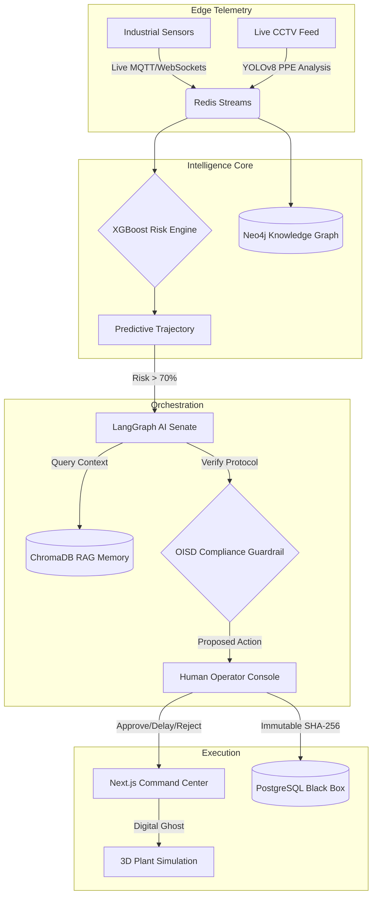

<div align="center">
  
  
  <h3><strong>ET AI Hackathon 2.0 | Grand Finale Submission</strong></h3>
  <p><em>Predicting the Unpredictable. Preventing the Unpreventable.</em></p>
  
  <p align="center">
    
    
    
    
  </p>
</div>

---

## ⚡ The Single-Command Deployment (Judges' Dream)

To start the entire Industrial Safety Operating System (Frontend, Backend, Redis, Neo4j, Postgres, and the IoT Simulator), run:

```bash
docker-compose down
docker-compose up --build -d
```
*Wait 30 seconds for the multi-container stack to initialize.* <br/>
*Open `http://localhost:3001` to view the Command Center.* <br/>
*Open `http://localhost:8001/docs` for the API.*

---

## 🏆 The Problem It Solves
**"Data is present, but unacted upon."**  
Over 6,500 fatal workplace accidents occurred in India in FY2023. In incidents like the Visakhapatnam Steel Plant explosion, sensor warnings existed but weren't correlated with human activity. SENTINEL-Φ bridges this gap by replacing fragmented dashboards with a unified **Industrial Safety Operating System (ISOS)**. It detects **compound risk conditions** (e.g., Gas Leak + Missing PPE + Zone Intrusion) that no single sensor would flag alone.

---

## 🚀 The WOW Moments (Our Signature Innovations)

<details open>
<summary><b>1. Palantir-Style Causality Engine & Knowledge Graph 🕸️</b></summary>
Risk isn't just a number—it's a story. Our Neo4j-backed causality engine connects <code>ENTITY_PERSON</code> (Worker 4182) to <code>ENTITY_ASSET</code> (Boiler-01) to <code>EVENT_TELEMETRY</code> (Gas > 35%). The frontend renders this as a beautiful top-down node graph, explaining exactly *why* the AI made a decision and referencing historical matches (e.g., Vizag 2020: 89% match).
</details>

<details open>
<summary><b>2. Dual-Mode Siemens-Grade Command Center 🏭</b></summary>
We abandoned generic web layouts. The UI is a gritty, monospaced, hyper-professional SCADA system. 
<ul>
  <li><b>Live Operations Mode</b>: Monitors Siemens-style SAP predictive maintenance data (Useful Life, Bearing Wear, Failure Probability).</li>
  <li><b>Incident Command Mode</b>: When a critical event happens, the UI violently transforms. Red alarms engage, the Digital Ghost visualizes a spreading gas cloud, and Emergency Tracking counts missing workers.</li>
</ul>
</details>

<details open>
<summary><b>3. Human-in-the-Loop Operator Console (No Black Box AI) 🛑</b></summary>
Industries don't trust autonomous AI shutdowns. SENTINEL-Φ features an Operations Advisory console. The AI proposes an action, runs it through a deterministic Python Compliance Guardrail (OISD standards), and then waits for the human Operator to explicitly click <b>[Approve]</b>, <b>[Delay]</b>, or <b>[Reject]</b>. Every action is logged to an immutable PostgreSQL Black Box.
</details>

<details open>
<summary><b>4. Live CCTV Vision Analytics (YOLOv8) 📹</b></summary>
Real-time CRT-style surveillance feeds with bounding box overlays. The AI doesn't just look for "people"—it performs granular PPE checks on Helmets, Vests, Gloves, and Boots, scoring each with a confidence metric and automatically tying violations to the active risk trajectory.
</details>

<details open>
<summary><b>5. The Multi-Agent Autonomous Senate 🏛️</b></summary>
Behind the scenes, a LangGraph Senate composed of <b>Safety, Operations, and Compliance</b> AI agents debate the best intervention strategy dynamically. They are backed by a ChromaDB RAG memory loaded with the hard facts of the 1984 Bhopal Gas Tragedy and strict OISD-STD-105 regulations.
</details>


---

## 🏗️ Architecture Pipeline



---

## 🎬 How to Run the Perfect Judge Demo

During the presentation, do not just click around. **Tell the story.** 

1. **Start the Engine:** Ensure the system is running via `docker-compose up -d`. Open `http://localhost:3001`.
2. **Explain the Normal State:** Show the **Live Operations** mode. Click on **Boiler-01** in the 3D view to show the SAP predictive maintenance telemetry (Bearing Wear, Useful Life).
3. **Trigger the Incident:** Look at the top right of the screen. Click the **⚠ (Critical Incident)** button in the Demo Scenarios widget.
4. **Narrate the Story (The 45-Second Crisis):**
   - **`T+0s`**: Watch the UI shift into **Incident Command Mode**.
   - **`T+8s`**: Point out the CRT CCTV feed logging a Worker Intrusion & Missing PPE.
   - **`T+19s`**: Show the **Knowledge Graph** tab mapping the compounding risk (Gas + Worker + Permit).
   - **`T+27s`**: Point out the **Historical Match** warning (Vizag 2020) triggering the AI Senate.
   - **`T+42s`**: The AI proposes an evacuation. Show the judges the **Operator Console**.
   - **`T+45s`**: Click **[Approve & Execute Evacuation]**. Watch the 3D Gas Cloud freeze, the Black Box log the SHA-256 hash, and the Emergency Tracker account for all 247 workers.
   
**The Pitch Conclusion:** *"This isn't a dashboard. It's the nervous system for zero-harm industrial operations."*

---
<div align="center">
  <h3>Built to win the ET AI Hackathon 2.0. Built to save lives.</h3>
  
</div>
