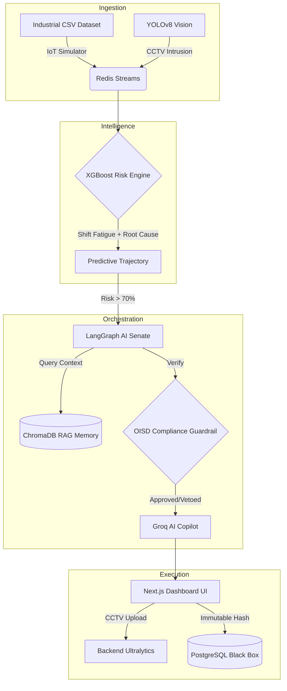

<div align="center">
  
  
  <h3><strong>ET AI Hackathon 2.0 | Grand Finale Submission</strong></h3>
  <p><em>Predicting the Unpredictable. Preventing the Unpreventable.</em></p>
  
  <p align="center">
    
    
    
  </p>
</div>

---

## ⚡ The Single-Command Deployment (Judges' Dream)

To start the entire Industrial Safety Operating System (Frontend, Backend, Redis, Neo4j, Postgres, and the IoT Simulator), you only need **one command**:

```bash
docker-compose up --build -d
```
*Wait 30 seconds.* <br/>
*Open `http://localhost:3001` to view the Dashboard.* <br/>
*Open `http://localhost:8001/docs` for the API.*

---

## 🏆 The Problem It Solves
**"Data present, but unacted upon."**  
Over 6,500 fatal workplace accidents occurred in India in FY2023. In incidents like the Visakhapatnam Steel Plant explosion, sensor warnings existed but weren't correlated with human activity. SENTINEL-Φ bridges this gap by detecting **compound risk conditions** (e.g., Gas Leak + Active Maintenance Permit + Shift Fatigue + Zone Intrusion) that no single sensor would flag alone.

---

## 🚀 The WOW Moments (Our Signature Innovations)

<details open>
<summary><b>1. Real Industrial Telemetry Engine 🏭</b></summary>
Unlike typical hackathon projects relying on `random.uniform()`, SENTINEL-Φ ingests actual row-by-row data from the `Industrial_fault_detection.csv` dataset. The system streams actual temperature, vibration, and pressure readings through Redis, mathematically predicting faults exactly as they would occur in a real plant.
</details>

<details open>
<summary><b>2. YOLOv8 CCTV Analytics (PPE & Intrusion) 📹</b></summary>
The system features a complete computer vision pipeline. Using the frontend's **CCTV Analytics** view, you can upload incident footage. The backend processes the video via Ultralytics YOLOv8, detecting unauthorized personnel or missing safety helmets. Detection of a PPE violation instantly correlates with IoT sensor data to spike the plant-wide Risk Score.
</details>

<details open>
<summary><b>3. Dynamic Root Cause & Shift Fatigue Engine 🧠</b></summary>
Risk isn't just a number. The system integrates industrial psychology. If an incident occurs during the Night Shift, the base risk score is mathematically multiplied (1.25x), and Operator Reliability plummets. When risk crosses 70%, the AI dynamically generates a composite Root Cause (e.g., <i>"Process Anomaly ↑ + Worker Intrusion/No PPE + Night Shift Fatigue"</i>).
</details>

<details open>
<summary><b>4. The Multi-Agent Autonomous Senate 🏛️</b></summary>
When things go critical, a LangGraph Senate composed of <b>Safety, Operations, Compliance, and Emergency Response</b> agents debates the best intervention strategy dynamically. They are backed by a ChromaDB RAG memory loaded with the hard facts of the 1984 Bhopal Gas Tragedy, the 2020 Vizag Leak, and strict OISD-STD-105 regulations.
</details>

<details open>
<summary><b>5. Deterministic Compliance Guardrail 🛑</b></summary>
The ultimate safety net. If the LLM Senate hallucinates an unsafe decision against OISD Factory Acts, this Python-native engine <b>VETOES</b> the AI and forces an evacuation.
</details>

---

## 🏗️ Architecture Pipeline



---

## 🎬 How to Run the Perfect Judge Demo

During the presentation, use the Digital Disaster Twin to show the exact lifecycle of an industrial crisis.

1. **Deploy the System:** `docker-compose up --build -d`
2. **Open the Dashboard:** Navigate to `http://localhost:3001`.
3. **Trigger the Vision AI:** Navigate to the **CCTV Analytics** tab and upload an MP4 of a PPE violation. Watch YOLOv8 log the violation.
4. **Narrate the Core Sequence:**
   - Immediately switch back to the **Command Center**.
   - Watch the live telemetry from the CSV dataset push the system towards a fault.
   - Point out the **Shift Fatigue** multiplier actively degrading Operator Reliability.
   - Point out the **Root Cause** engine declaring exactly what is happening.
   - Watch the Risk Trajectory spike to 100%.
   - Watch the AI Senate debate, recall Bhopal/Vizag from RAG, get vetoed by Compliance, and trigger the evacuation.
   - Click the red **EXECUTE INTERVENTION** button on the UI.

---
<div align="center">
  <h3>Built to win the ET AI Hackathon 2.0. Built to save lives.</h3>
  
</div>
