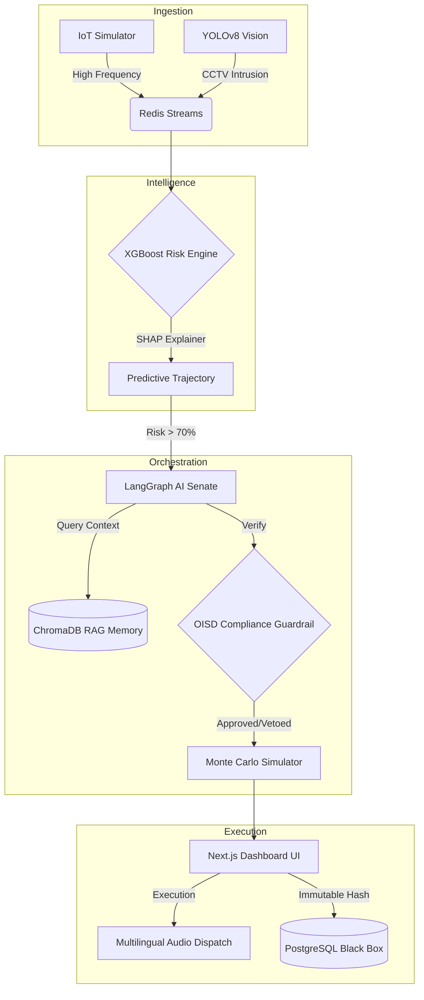

<div align="center">
  
  
  <h3><strong>ET AI Hackathon 2.0 | Grand Finale Submission</strong></h3>
  <p><em>Predicting the Unpredictable. Preventing the Unpreventable.</em></p>
  
  <p align="center">
    
    
    
  </p>
</div>

---

## ⚡ The Single-Command Deployment (Judges' Dream)

To start the entire Industrial Safety Operating System (Frontend, Backend, Redis, Neo4j, Postgres, and the IoT Simulator), you only need **one command**:

```bash
docker compose up -d
```
*Wait 30 seconds.* <br/>
*Open `http://localhost:3001` to view the Dashboard.* <br/>
*Open `http://localhost:8001/docs` for the API.*

---

## 🏆 The Problem It Solves
**"Data present, but unacted upon."**  
Over 6,500 fatal workplace accidents occurred in India in FY2023. In incidents like the Visakhapatnam Steel Plant explosion, sensor warnings existed but weren't correlated with human activity. SENTINEL-Φ bridges this gap by detecting **compound risk conditions** (e.g., Gas Leak + Active Maintenance Permit + Shift Fatigue + Zone Intrusion) that no single sensor would flag alone.

---

## 🚀 The WOW Moments (Our Signature Innovations)

<details open>
<summary><b>1. The Intelligence Layer Panel 🧠</b></summary>
Right at the top of the dashboard, there is an undeniable "truth panel" aggregating:
- <b>Compound Risk</b>
- <b>Safety Culture Score</b> (Trending ↑ or ↓ based on systemic anomalies to combat "Normalization of Deviance")
- <b>Operator Reliability Index</b> (Calculated via zone fatigue)
- <b>Historical Precedents</b> (Counting exact similar near-misses found via RAG memory)
</details>

<details open>
<summary><b>2. Predictive Risk Trajectory 📈</b></summary>
Instead of saying "Current risk is 84%", the UI now displays a dynamic trajectory for <b>+5m, +10m, and +15m</b>, proving the system mathematically predicts the disaster before it happens.
</details>

<details open>
<summary><b>3. The Multi-Agent Autonomous Senate 🏛️</b></summary>
When things go critical, a LangGraph Senate composed of <b>Safety, Operations, Compliance, and Emergency Response</b> agents debates the best intervention strategy dynamically.
</details>

<details open>
<summary><b>4. Deterministic Compliance Guardrail 🛑</b></summary>
The ultimate safety net. If the LLM Senate hallucinates an unsafe decision against OISD Factory Acts, this Python-native engine <b>VETOES</b> the AI and forces an evacuation.
</details>

---

## 🏗️ Architecture Pipeline



---

## 🎬 How to Execute the "Critical Incident Simulation"

During the presentation, use the Digital Disaster Twin to show the exact lifecycle of an industrial crisis.

1. **Deploy the System:** `docker compose up -d`
2. **Open the Dashboard:** Navigate to `http://localhost:3001`.
3. **Trigger the Simulation:** In a new terminal, inject the crisis:
   ```bash
   docker exec -it sentinel_backend python run_demo.py
   ```
4. **Narrate the Sequence:**
   - Watch the shift change and Operator Reliability drop.
   - Watch the CCTV Vision (YOLOv8) detect an unauthorized intrusion.
   - Watch the Risk Trajectory spike to 100%.
   - Watch the Senate debate, get vetoed by Compliance, and trigger the evacuation.
   - Click the red **EXECUTE** button on the UI.

---
<div align="center">
  <h3>Built to win the ET AI Hackathon 2.0. Built to save lives.</h3>
  
</div>
